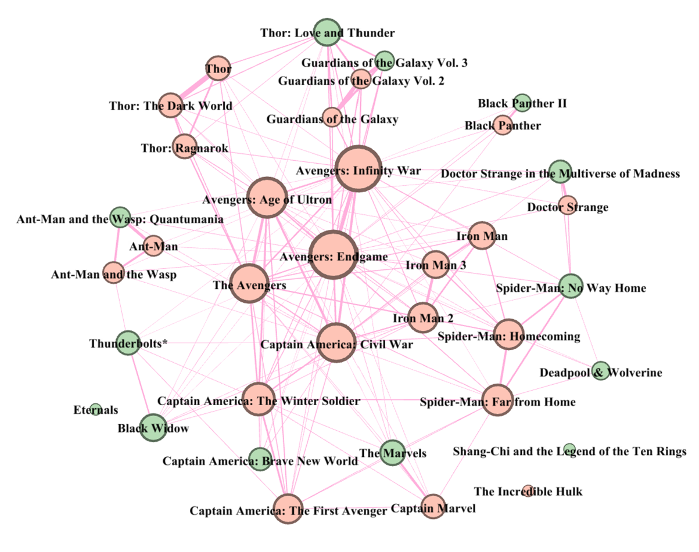

# Network analysis

## Overview

This repository provides replication code for the network visualization of Marvel Cinematic Universe (MCU) films reported in Figure 1 of the accompanying manuscript. The paper examines whether films’ commercial performance within the MCU is associated with narrative interconnectedness in a shared cinematic universe.

The repository includes input data in Excel format:
- *mcu_global.xlsx*: Dataset containing information on the Marvel Cinematic Universe (MCU).


<p align="center">
  <br>
  Figure 1. Network map of MCU films.
</p>

Figure 1 presents a film-level network of the MCU. Nodes represent individual MCU films. Edges encode pairwise narrative linkages based on character overlap, operationalized using the Jaccard similarity between the sets of heroes appearing in two films:
```math
\mathrm{Similarity}(A,B)=\frac{n(A\cap B)}{n(A\cup B)},
```
where $A$ and $B$ denote the sets of heroes appearing in each films.

The visualization provides an interpretable representation of the franchise’s relational structure and serves as descriptive evidence for our empirical analysis of interconnectedness and films’ commercial success.


## Replication
The code in this repository reproduces Figure 1 (subject to platform-specific rendering differences). Running the provided scripts will (i) construct the MCU film network from the underlying inputs and (ii) generate the corresponding node–edge visualization. The resulting network is saved as a GraphML file and can be loaded into Gephi for further inspection and visualization.


```python
import pandas as pd
# Load the MCU dataset from an Excel file
df = pd.read_excel('mcu_global.xlsx')

# Data Preprocessing: Extract only necessary columns (Title, Phase, Cast)
df1 = df.iloc[:,[1,2,8]]
# Split the 'Cast' string into a list, removing extra whitespace
df1['Cast'] = df1['Cast'].str.split(r',\s*')
# Remove rows with missing values
df1 = df1.dropna()

# Function to calculate Jaccard Similarity (Intersection over Union) of casts
def weight_counter(a,b):
    set1 = set(a)
    set2 = set(b)
    intersection = set1.intersection(set2)
    union = set1.union(set2)
    # Return similarity score; return 0 if there is no union to avoid division by zero
    return len(intersection) / len(union) if union else 0

# Initialize a weight matrix with movie titles as indices and columns
n = len(df1)
weight_matrix = pd.DataFrame(index = df1['Title'] , columns = df1['Title'], dtype = 'float')

# Fill the matrix with weight values to check the influence/overlap between movies
for i in range(n):
    for j in range(n):
        weight_matrix.iloc[i, j] = weight_counter(df1.iloc[i]['Cast'], df1.iloc[j]['Cast'])


# Network Construction
# Assign groups based on Marvel Phase (Phase 1-3 as group1, others as group2)
phase_map = {
    row['Title']: ('group1' if row['Phase'] <= 3 else 'group2') 
    for _, row in df1.iterrows()
}

# Network Analysis using NetworkX
import networkx as nx
import matplotlib.pyplot as plt

# Initialize an undirected graph
G = nx.Graph()

# Add nodes: Use movie titles from the weight matrix index
for movie in weight_matrix.index:
    G.add_node(movie)

# Add edges: Connect movies only if the similarity weight is greater than 0
for i in range(n):
    for j in range(i+1, n):  # Skip the diagonal and lower triangle to avoid duplicates
        weight = weight_matrix.iloc[i, j]
        
        if weight > 0:
            movie1 = weight_matrix.index[i]
            movie2 = weight_matrix.columns[j]
            G.add_edge(movie1, movie2, weight=weight)

# Assign metadata (Phase group) to each node in the graph            
for node in G.nodes():
    G.nodes[node]['group'] = phase_map.get(node, 'Other')

# Export the graph to a .graphml file for visualization in Gephi
nx.write_graphml(G, 'marvel.graphml')

```
